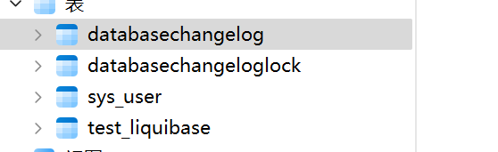
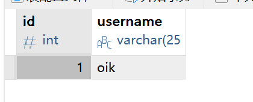
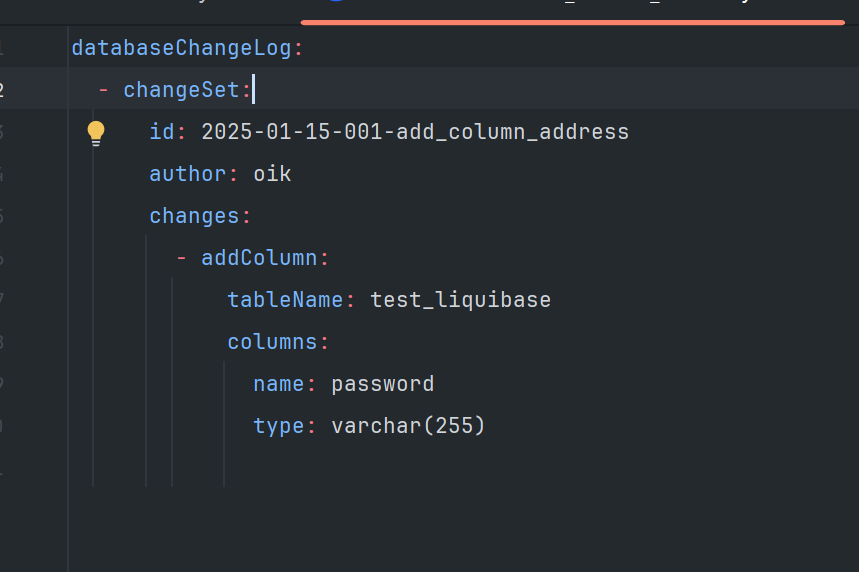
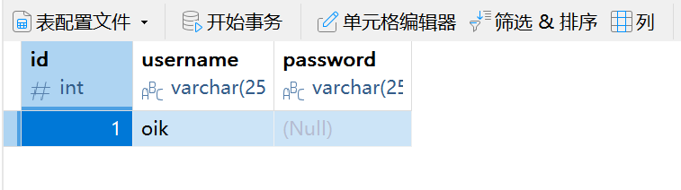
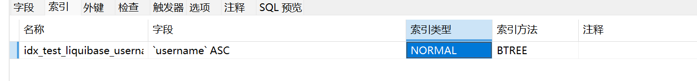

## liquibase 对比两数据库 生成changelog.yaml 并同步数据库

### 安装 Liquibase

下载连接 ：[Download Liquibase | Liquibase.com](https://www.liquibase.com/download)


### 运行 `diff-changelog` 命令

```bash
# 创建一个空文件夹
liquibase init project
```

修改配置文件

```properties
## 初始化项目后会有liquibase.properties 文件
## 运行之前先将数据库驱动放在 liquibase 安装目录lib 文件夹下
changeLogFile=example-changelog.sql
liquibase.command.driver=com.mysql.cj.jdbc.Driver
## 目标数据库
liquibase.command.url=jdbc:mysql://ip:3306/study_copy?useUnicode=true&characterEncoding=UTF-8
liquibase.command.username=username
liquibase.command.password=password
## 源数据库
liquibase.command.referenceUrl=jdbc:mysql://ip:3306/study?useUnicode=true&characterEncoding=UTF-8
liquibase.command.referenceUsername=username
liquibase.command.referencePassword=password
```

生成changelog.yaml 文件

```bash
liquibase  --changeLogFile=changelog.yaml diff-changelog
```

生成结果

```yaml
databaseChangeLog:
- changeSet:
    id: 1740016593264-2
    author: 15093 (generated)
    changes:
    - addColumn:
        columns:
        - column:
            name: phone
            remarks: 电话
            type: VARCHAR(255)
        tableName: test_liquibase
- changeSet:
    id: 1740016593264-1
    author: 15093 (generated)
    changes:
    - setColumnRemarks:
        columnDataType: varchar(255)
        columnName: name
        remarks: 名称
        tableName: test_liquibase


```


应用变更日志

```shell
liquibase --changeLogFile=changelog.yaml update
```


## liquibase 命令

### 1. **核心命令**

#### `update`

将 `changelog` 文件中未应用的变更应用到数据库。

```bash
liquibase update
```

- **作用**：根据 `changelog` 文件（如 `changelog.xml` 或 `changelog.yaml`）中的变更集（changeSet），更新数据库结构。

- **常用参数**：
  
  - `--changelogFile`：指定变更日志文件路径。
  
  - `--url`：指定数据库连接 URL。
  
  - `--username`：数据库用户名。
  
  - `--password`：数据库密码。

#### `updateSQL`

生成 SQL 脚本，但不执行。

```bash
liquibase updateSQL
```

#### `rollback`

回滚数据库到指定的变更集

```bash
liquibase rollbackCount 1
```

- **作用**：回滚指定数量的变更集。

- **常用参数**：
  
  - `--rollbackCount`：回滚的变更集数量。
  
  - `--tag`：回滚到指定的标签（tag）。

- **示例**：
  
  - 回滚最近 1 个变更集：`liquibase rollbackCount 1`
  
  - 回滚到标签 `v1.0`：`liquibase rollback v1.0`

#### `rollbackSQL`

生成回滚 SQL 脚本，但不执行。

```bash
liquibase rollbackSQL
```

- **作用**：生成回滚数据库变更的 SQL 脚本，但不会实际执行。

- **适用场景**：用于检查回滚操作将执行的 SQL 语句。

#### `status`

显示数据库的变更状态。

```bash
liquibase status
```

- **作用**：检查当前数据库与 `changelog` 文件的差异，显示未应用的变更集。

- **适用场景**：用于检查数据库是否需要更新。


#### `validate`

验证 `changelog` 文件的正确性。

```bash
liquibase validate
```

- **作用**：检查 `changelog` 文件是否有语法错误或逻辑问题。

- **适用场景**：在应用变更之前验证变更日志文件。

#### `generate-changelog`

从现有数据库生成 `changelog` 文件。

```bash
liquibase generate-changelog
```

- **作用**：根据当前数据库结构生成一个初始的 `changelog` 文件。

- **常用参数**：
  
  - `--changelogFile`：指定生成的变更日志文件路径。
  
  - `--diffTypes`：指定生成的变更类型（如表、视图、存储过程等）。

- 示例

```bash

liquibase --changelogFile=changelog.yaml generate-changelog
```

#### `diff`

比较两个数据库的差异。

```bash
liquibase diff
```

- **作用**：比较两个数据库的结构差异。

- **常用参数**：
  
  - `--referenceUrl`：参考数据库的 JDBC URL。
  
  - `--referenceUsername`：参考数据库的用户名。
  
  - `--referencePassword`：参考数据库的密码。
  
  - `--url`：目标数据库的 JDBC URL。
  
  - `--username`：目标数据库的用户名。
  
  - `--password`：目标数据库的密码。

- 示例
  
  ```bash
  liquibase --referenceUrl=jdbc:mysql://localhost:3306/reference_db \
            --referenceUsername=root \
            --referencePassword=root \
            --url=jdbc:mysql://localhost:3306/target_db \
            --username=root \
            --password=root \
            diff
  ```

#### `diff-changelog`

比较两个数据库的差异并生成 `changelog` 文件。

```bash
liquibase --referenceUrl=jdbc:mysql://localhost:3306/reference_db \
          --referenceUsername=root \
          --referencePassword=root \
          --url=jdbc:mysql://localhost:3306/target_db \
          --username=root \
          --password=root \
          --changelogFile=diff-changelog.yaml \
          diff-changelog
```

### 2. **其他常用命令**

#### `tag`

为当前数据库状态打标签。

```bash
liquibase tag v1.0
```

- **作用**：为当前数据库状态打标签，便于后续回滚。

- **示例**：

```bash
liquibase tag v1.0
```

#### `history`

显示数据库的变更历史。

```bash
liquibase history
```

- **作用**：显示数据库中已应用的变更集历史记录。

#### `future-rollbackSQL`

生成未来回滚的 SQL 脚本。

```bash
liquibase future-rollbackSQL
```

**作用**：生成未来回滚当前数据库状态所需的 SQL 脚本

#### `snapshot`

生成数据库的快照。

```bash
liquibase snapshot
```

- **作用**：生成当前数据库结构的快照，保存为 JSON 或 YAML 文件。

### 3. **常用参数**

以下是一些通用的 Liquibase 参数：

| 参数                | 说明                                             |
| ----------------- | ---------------------------------------------- |
| `--changelogFile` | 指定变更日志文件路径。                                    |
| `--url`           | 指定数据库连接 URL。                                   |
| `--username`      | 指定数据库用户名。                                      |
| `--password`      | 指定数据库密码。                                       |
| `--driver`        | 指定 JDBC 驱动类名（如 `com.mysql.cj.jdbc.Driver`）。    |
| `--classpath`     | 指定 JDBC 驱动程序的路径。                               |
| `--logLevel`      | 设置日志级别（如 `debug`、`info`、`warn`、`error`）。       |
| `--defaultsFile`  | 指定 Liquibase 配置文件路径（如 `liquibase.properties`）。 |

查看 Liquibase 的帮助文档：

```bash
liquibase --help
```


## liquibase springboot

#### 引入

gradle

```groovy
implementation 'org.liquibase:liquibase-core:4.30.0'
```

maven

```xml
<dependency>
    <groupId>org.liquibase</groupId>
    <artifactId>liquibase-core</artifactId>
    <version>4.30.0</version>
</dependency>
```

#### 编写配置文件

```yaml
# 在配置文件中中配置Liquibase
spring:
  liquibase:
    change-log: classpath:liquibase/changelog/changelog-master.yaml

# 在resources 下创建文件夹 liquibase/changelog/changes
# 在liquibase/changelog下创建 changelog-master.yaml
# 在liquibase/changelog/changes下创建 001-initial-schema.yaml
# changelog-master.yaml:

databaseChangeLog:
  - include:
      file: classpath:liquibase/changelog/changes/001-initial-schema.yaml

# 001-initial-schema.yaml
databaseChangeLog:
  - changeSet:
      id: 1
      author: oik
      changes:
        - createTable:
            tableName: test_liquibase
            columns:
              - column:
                  name: id
                  type: int
                  constraints:
                    primaryKey: true
                    nullable: false
              - column:
                  name: username
                  type: varchar(255)
                  constraints:
                  nullable: false
```

启动项目





生成数据库

#### Liquibase databaseChangeLog 所有属性解析

Liquibase 的 databaseChangeLog 是一个 YAML 或 XML 文件，用于定义数据库模式变更。以下是 databaseChangeLog 中所有可能的属性及其解释：

- databaseChangeLog
  这是根元素，包含所有的变更集（changeSet）。

- changeSet
  每个 changeSet 定义了一组要应用到数据库的更改。它有以下属性：
  id (必填)：唯一标识符，确保每个变更集在整个项目中是唯一的。
  author (必填)：变更集的作者。
  context (可选)：指定在哪些上下文中应用此变更集。可以是逗号分隔的字符串。
  labels (可选)：为变更集添加标签，便于过滤和管理。
  dbms (可选)：指定适用的数据库类型，如 MySQL、PostgreSQL 等。
  runAlways (可选)：如果设置为 true，每次运行时都会执行该变更集，默认为 false。
  runOnChange (可选)：如果设置为 true，当文件内容发生变化时会重新执行，默认为 false。
  failOnError (可选)：如果设置为 false，即使发生错误也不会中断整个变更日志的执行，默认为 true。
  validCheckSum (可选)：指定校验和，用于验证变更集是否已正确应用。
  rollback (可选)：定义回滚操作，以便在需要时撤销变更集。

- changes
  每个 changeSet 包含一个或多个 changes，每个 change 定义具体的数据库操作。常见的 change 类型包括：
  addColumn：向表中添加新列。
  dropColumn：从表中删除列。
  addPrimaryKey：为表添加主键。
  dropPrimaryKey：删除表的主键。
  createTable：创建新表。
  dropTable：删除表。
  insert：插入数据。
  update：更新数据。
  delete：删除数据。
  renameColumn：重命名列。
  renameTable：重命名表。
  modifyDataType：修改列的数据类型。
  addForeignKeyConstraint：添加外键约束。
  dropForeignKeyConstraint：删除外键约束。
  
  createIndex 添加索引
  sql：执行自定义 SQL 语句。

- columns
  对于某些 change 类型（如 addColumn），可以定义 columns 来描述列的详细信息：
  name (必填)：列名。
  type (必填)：列的数据类型，如 varchar(255)、int 等。
  value (可选)：默认值。
  constraints (可选)：定义列的约束条件，如 primaryKey、nullable 等。

#### 测试

配置添加字段：



测试结果：



测试添加索引：

```yaml
databaseChangeLog:
  - changeSet:
      id: 2025-01-15-002-initial-schema
      author: oik
      changes:
        - createIndex:
            tableName: test_liquibase
            indexName: idx_test_liquibase_username
            columns:
              name: username
```

结果：



### 补充和示例

### 常见的 `changes` 操作类型及其属性

#### 1. **createTable**

- 用于创建表。

- **属性**：
  
  - `tableName`：表名（必需）。
  - `schemaName`：模式名称（可选）。
  - `catalogName`：目录名称（可选）。
  - `tablespace`：表空间（可选）。
  - `columns`：定义列的列表（必需）。

- **列的属性**：
  
  - `name`：列名（必需）。
  - `type`：数据类型（必需）。
  - `autoIncrement`：是否自增（可选，布尔值）。
  - `constraints`：列约束（可选）。
    - `primaryKey`：是否为主键。
    - `nullable`：是否允许为空。
    - `unique`：是否唯一。
    - `foreignKeyName`：外键名称。
    - `referencedTableName`：引用的表名。
    - `referencedColumnNames`：引用的列名。

- **示例**：
  
  ```yaml
  changes:
    - createTable:
        tableName: example
        columns:
          - column:
              name: id
              type: int
              autoIncrement: true
              constraints:
                primaryKey: true
          - column:
              name: name
              type: varchar(255)
  ```

---

#### 2. **addColumn**

- 用于向表中添加列。

- **属性**：
  
  - `tableName`：目标表名（必需）。
  - `schemaName`：模式名称（可选）。
  - `columns`：定义新列的列表（必需）。

- **列的属性**与 `createTable` 类似。

- **示例**：
  
  ```yaml
  changes:
    - addColumn:
        tableName: example
        columns:
          - column:
              name: age
              type: int
              constraints:
                nullable: false
  ```

---

#### 3. **dropColumn**

- 用于删除列。

- **属性**：
  
  - `tableName`：目标表名（必需）。
  - `columnName`：要删除的列名（必需）。
  - `schemaName`：模式名称（可选）。

- **示例**：
  
  ```yaml
  changes:
    - dropColumn:
        tableName: example
        columnName: age
  ```

---

#### 4. **renameColumn**

- 用于重命名列。

- **属性**：
  
  - `tableName`：目标表名（必需）。
  - `oldColumnName`：旧列名（必需）。
  - `newColumnName`：新列名（必需）。
  - `columnDataType`：数据类型（可选）。
  - `schemaName`：模式名称（可选）。

- **示例**：
  
  ```yaml
  changes:
    - renameColumn:
        tableName: example
        oldColumnName: name
        newColumnName: full_name
  ```

---

#### 5. **insert**

- 用于向表中插入数据。

- **属性**：
  
  - `tableName`：目标表名（必需）。
  - `schemaName`：模式名称（可选）。
  - `columns`：包含列名和值的列表（必需）。
    - 每个列定义为 `name` 和 `value`。

- **示例**：
  
  ```yaml
  changes:
    - insert:
        tableName: example
        columns:
          - column:
              name: id
              value: 1
          - column:
              name: name
              value: 'Sample Data'
  ```

---

#### 6. **update**

- 用于更新表中的数据。

- **属性**：
  
  - `tableName`：目标表名（必需）。
  - `schemaName`：模式名称（可选）。
  - `where`：条件语句，用于指定要更新的行（必需）。
  - `columns`：包含列名和值的列表（必需）。

- **示例**：
  
  ```yaml
  changes:
    - update:
        tableName: example
        where: id=1
        columns:
          - column:
              name: name
              value: 'Updated Data'
  ```

---

#### 7. **delete**

- 用于从表中删除数据。

- **属性**：
  
  - `tableName`：目标表名（必需）。
  - `schemaName`：模式名称（可选）。
  - `where`：条件语句，用于指定要删除的行（可选）。

- **示例**：
  
  ```yaml
  changes:
    - delete:
        tableName: example
        where: id=1
  ```

---

#### 8. **createIndex**

- 用于创建索引。

- **属性**：
  
  - `indexName`：索引名称（必需）。
  - `tableName`：目标表名（必需）。
  - `columns`：定义索引列的列表（必需）。
  - `unique`：是否为唯一索引（可选）。

- **示例**：
  
  ```yaml
  changes:
    - createIndex:
        indexName: idx_name
        tableName: example
        unique: true
        columns:
          - column:
              name: name
  ```

---

#### 9. **dropIndex**

- 用于删除索引。

- **属性**：
  
  - `indexName`：索引名称（必需）。
  - `tableName`：目标表名（必需）。

- **示例**：
  
  ```yaml
  changes:
    - dropIndex:
        indexName: idx_name
        tableName: example
  ```

---

#### 10. **customChange**

- 用于定义自定义的数据库变更。

- **属性**：
  
  - `class`：自定义类的完全限定名称（必需）。
  - `parameters`：传递给自定义类的参数（可选）。

- **示例**：
  
  ```yaml
  changes:
    - customChange:
        class: com.example.CustomTask
        parameters:
          param1: value1
  ```

---

### 其他常见操作

- **renameTable**：重命名表。
- **dropTable**：删除表。
- **addForeignKeyConstraint**：添加外键约束。
- **dropForeignKeyConstraint**：删除外键约束。
- **addUniqueConstraint**：添加唯一约束。
- **dropUniqueConstraint**：删除唯一约束。
- **addPrimaryKey**：添加主键。
- **dropPrimaryKey**：删除主键。
