## 本地部署ai

### 安装模型管理 Ollama

下载连接 ：[Download Ollama | ollama.com](https://ollama.com/download)

ollama 环境变量

```bash
# 定义 Ollama 监听的网络接口。例如，设置 OLLAMA_HOST=0.0.0.0 可以让 Ollama 监听所有可用的网络接口
export OLLAMA_HOST=0.0.0.0
# 指定模型镜像的存储路径。例如，设置 OLLAMA_MODELS=/mnt/rayse/files/ollama/models 可以将模型镜像存储在指定路径
export OLLAMA_MODELS=/mnt/rayse/files/ollama/models
# 控制模型在内存中的存活时间。例如，设置 OLLAMA_KEEP_ALIVE=1h 可以让模型在内存中保持1小时
export OLLAMA_KEEP_ALIVE=1h
# 更改 Ollama 的默认端口。例如，设置 OLLAMA_PORT=8080 可以将服务端口从默认的11434更改为8080
export OLLAMA_PORT=8080
# 决定 Ollama 可以同时处理的用户请求数量。例如，设置 OLLAMA_NUM_PARALLEL=4 可以让 Ollama 同时处理四个并发请求
export OLLAMA_NUM_PARALLEL=4
# 限制 Ollama 可以同时加载的模型数量。例如，设置 OLLAMA_MAX_LOADED_MODELS=4 可以确保系统资源得到合理分配
export OLLAMA_MAX_LOADED_MODELS=4
```

选择模型 ([Ollama Search](https://ollama.com/search))

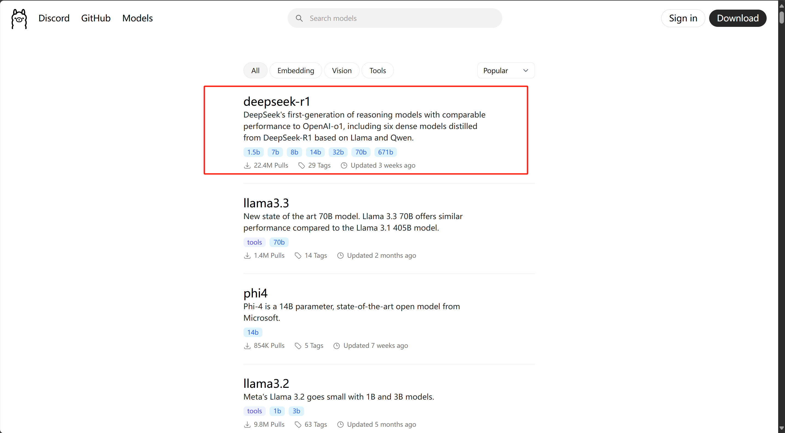

选择deepseek模型

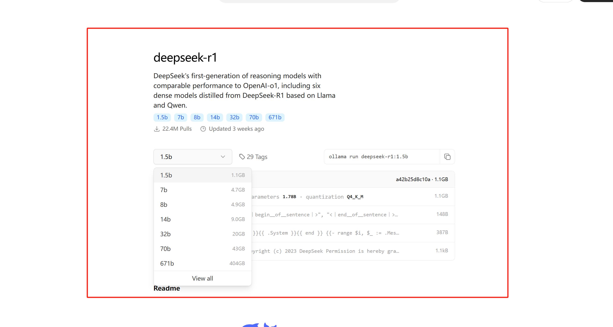

复制右边命令并运行

```bash
# 自己部署运行可以用一个最小的试试
ollama run deepseek-r1:1.5b
```

测试

```bash
C:\Users\15093>ollama run deepseek-r1:1.5b
>>> hello
<think>

</think>

Hello! How can I assist you today? 😊

>>> 帮我写个希尔排序
<think>

</think>

希尔排序（Shellsort）是一种适应性强的 sorts算法，最初由 German 希尔提出。它基于分而治之的思想，通过多次细分待排序列
表来提高效率。

### 基本思想
希尔排序的基本思想是：首先将待排序数组两两配对比较，将较小元素放在前面；然后将相邻的三元组进行排序，直至整个序列被排
完。这种方法与直接插入排序中的“两阶段插入”类似，但在第二阶段中，每次都将相邻的三元组排序。

### 希尔排序算法步骤
1. **初始间隔选择**：选择一个初始的间隔值 h。
2. **分组比较排序**：
   - 对于每对距离为 h 的元素进行比较，将较小的放在前面。
   - 然后移动间隔值到下一个更大的倍数（如 2h、3h 等）。
3. **重复过程**：直到间隔变为零。

### 示例
例如，对数组 [22, 7, 15, 8, 9, 4] 进行希尔排序：

1. 首先选择 h = 3：
   - 将元素分成三组：[22, 7], [15, 8, 9], [4]
   - 对每一组进行比较，排序后得到：[7, 22], [8, 9, 15], [4]

2. 移动间隔到 h = 6：
   - 将元素分成两组：[22, 7, 8, 9, 15, 4]
   - 对每一组进行比较，排序后得到：[7, 8, 9, 15, 22, 4]

3. 最终间隔变为零，完成排序。

### Python 实现
以下是实现希尔排序的示例代码：

python

def shellsort(arr):
    n = len(arr)
    h = n // 2

    while h > 0:
        # 分组比较排序
        for i in range(n - h * (h + 1) // 2, n):
            arr[i::h] = sorted(arr[i::h], reverse=True)

        h = n // 2


### 时间复杂度
希尔排序的时间复杂度取决于初始间隔和最终间隔的选择。在最坏情况下，其时间复杂度为 O(n²)，但在平均情况下通常更快。

### 空间复杂度
希尔排序的空间复杂度为 O(1)。

如果你需要更详细的实现或优化，请告诉我！ 😊

>>> Send a message (/? for help)
```

### 深度文档理解构建

#### 准备环境

> 1.docker  windows上也可以下载docker

> 2.rag开源项目 ragflow maxkb 等

#### 使用 ragflow

```bash
# 文档：https://github.com/infiniflow/ragflow/blob/main/README_zh.md
# 克隆仓库
git clone https://github.com/infiniflow/ragflow.git
```

```bash
cd ragflow/docker
# 修改.env文件 
# 将 RAGFLOW_IMAGE=infiniflow/ragflow:v0.17.0-slim 修改为 RAGFLOW_IMAGE=infiniflow/ragflow:v0.17.0
# slim 不具备嵌套模型
RAGFLOW_IMAGE=infiniflow/ragflow:v0.17.0
```

```bash
# 启动ragflow
cd ragflow/docker
docker compose -f docker-compose.yml up -d
```

运行完成


添加模型

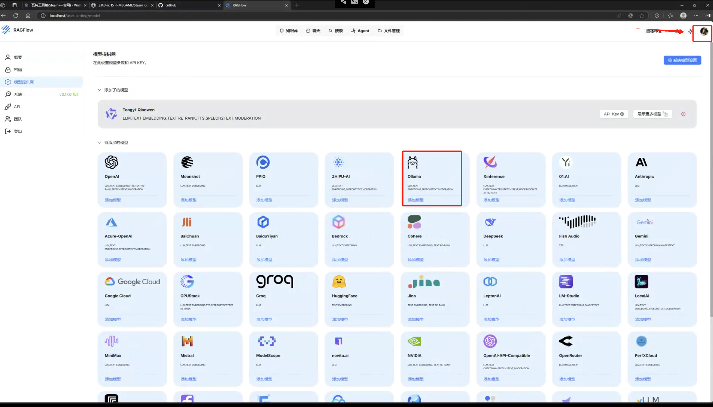


设置模型

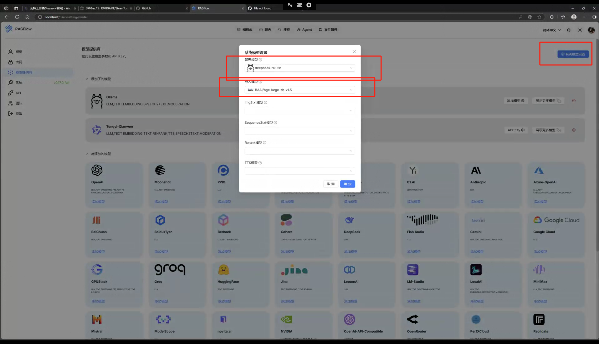

创建知识库

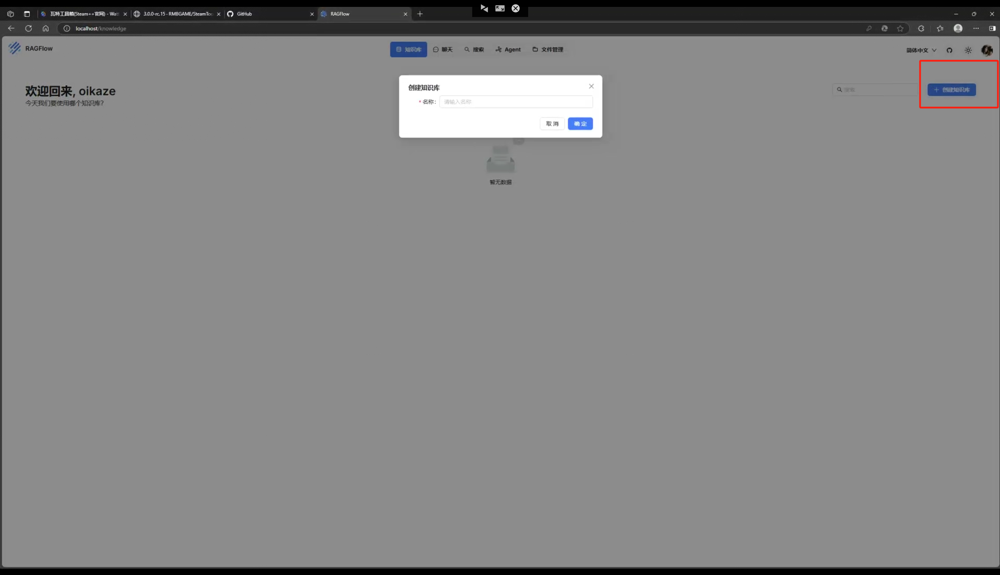

    

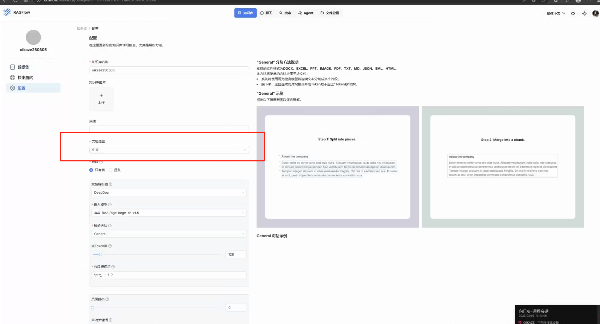

上传文档

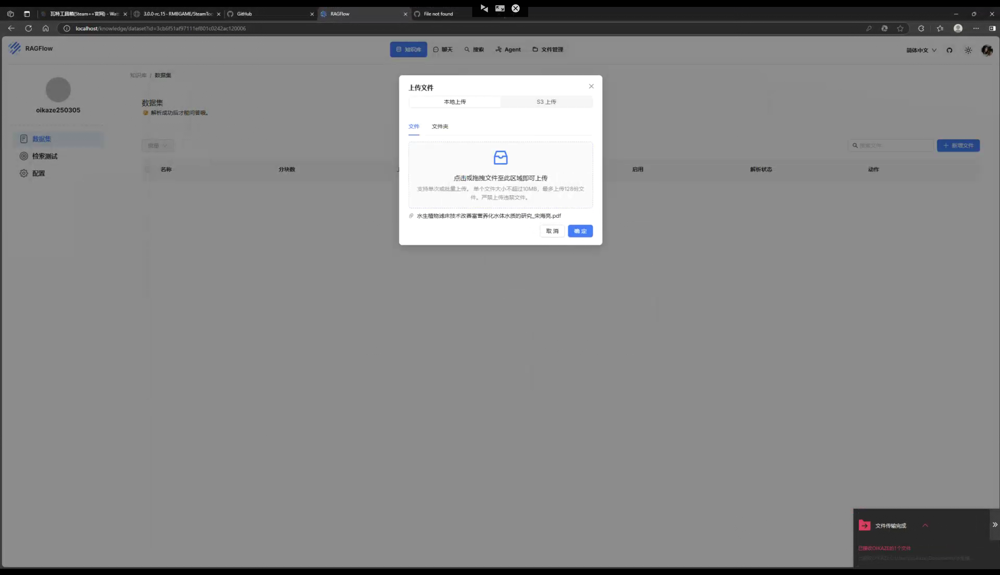

解析文档

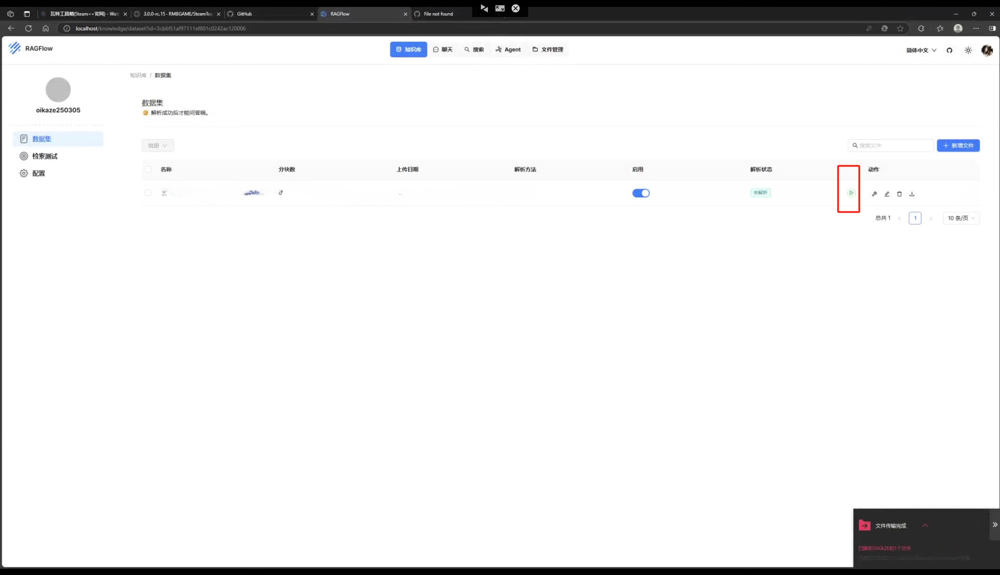

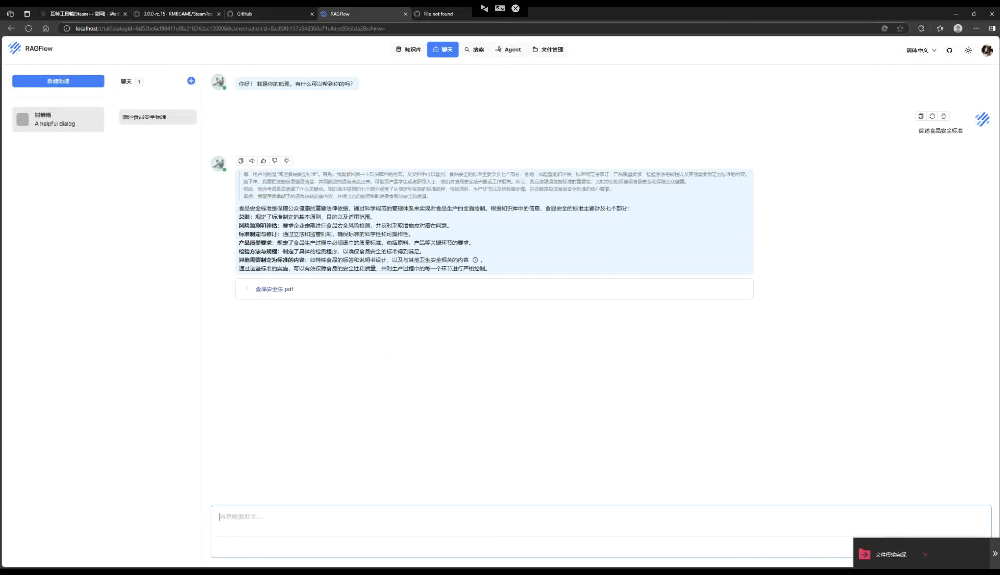

#### 使用 maxkb

运行

```bash
# Linux 机器
docker run -d --name=maxkb --restart=always -p 8080:8080 -v ~/.maxkb:/var/lib/postgresql/data -v ~/.python-packages:/opt/maxkb/app/sandbox/python-packages registry.fit2cloud.com/maxkb/maxkb

# Windows 机器
docker run -d --name=maxkb --restart=always -p 8080:8080 -v C:/maxkb:/var/lib/postgresql/data -v C:/python-packages:/opt/maxkb/app/sandbox/python-packages registry.fit2cloud.com/maxkb/maxkb

# 用户名: admin
# 密码: MaxKB@123..
```

添加模型

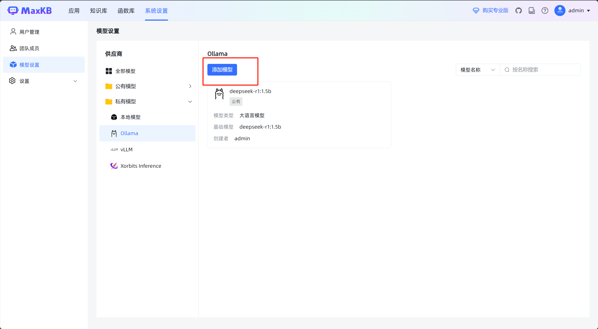

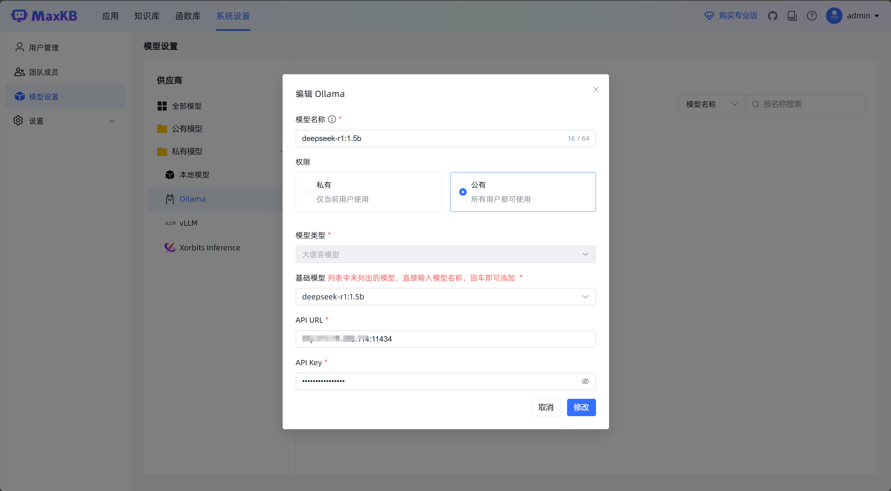

创建知识库


测试


